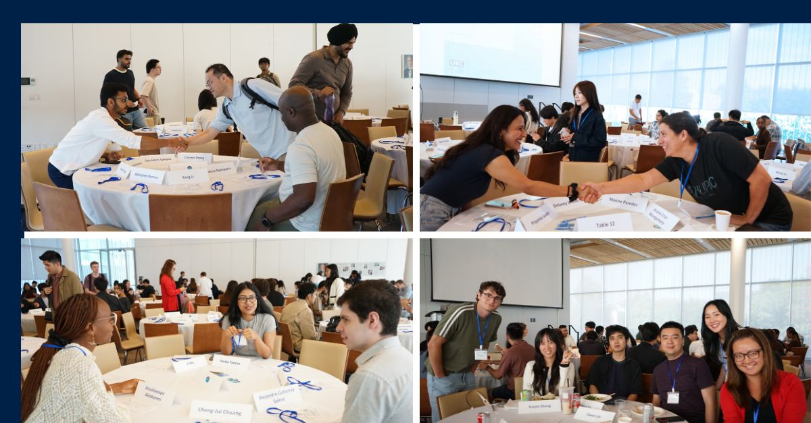

I drove into Vancouver on August 9th with a car full of boxes and spent the
month before classes on logistics. Orientation was mostly a blur of names, but
one thing landed: this is a cohort program — same people, same four courses,
same room, every day until May. Then classes started and it was DSCI 551, 523,
511, and 521 all at once, each with labs. The site you are reading is a 521
deliverable, which is a slightly strange thing to write in a blog post.

I assumed the tooling would be the easy part. Instead my first real fight of the term was with SSH: I could not clone from github.ubc.ca at all, and the cause turned out to be an IdentityFile mismatch once I had more than one key on the machine. R surprised me too. I write Python for a living and figured a second language would be translation work, then lost an embarrassing stretch of time to the difference between list(values) and as.list(values), which are not the same thing and do not fail loudly when you pick wrong. 

The best surprise was conceptual. In 551 something clicked about the difference
between a parametric family, a specific distribution inside it, the parameters
that pick it out, and the values you actually observe — four things I had been
using interchangeably for years. That is the whole reason I came: I was good at
building pipelines and much shakier on what the numbers coming out of them
meant. Being the least informed person in the room again is uncomfortable and
clearly the point. Ask me again after midterms.

